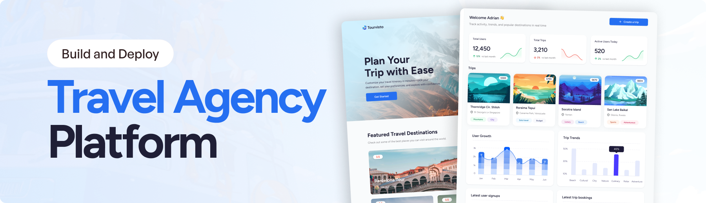

# 🌏 Kokoro Travel

> An AI-powered travel planning and management dashboard built with React Router, TypeScript, Appwrite, and Google Gemini.

[](https://travel-agency-dashboard-kohl.vercel.app/)



## 🇬🇧 English

### 📌 About the Project

**Kokoro Travel** is a full-stack travel planning application that I built to combine AI-generated travel itineraries with a practical admin dashboard.

The main idea was to make travel planning more interactive: instead of manually creating a complete itinerary, the user provides a few preferences such as destination, duration, budget, travel style, interests, and group type. The application then uses **Google Gemini** to generate a structured travel plan.

The project also includes an admin dashboard where generated trips and registered users can be viewed and managed.

🔗 **Live Demo:** https://travel-agency-dashboard-kohl.vercel.app/

---

## ✨ Features

### 🤖 AI Travel Plan Generation

Users can create a trip by selecting:

- 🌍 Country / destination
- 📅 Trip duration
- 💰 Budget
- 🧭 Travel style
- ❤️ Interests
- 👥 Group type

The form sends these preferences to the server, where Gemini generates a structured itinerary containing:

- Trip name
- Description
- Estimated price
- Duration
- Travel style
- Budget
- Interests
- Group type
- Best time to visit
- Weather information
- Destination coordinates
- OpenStreetMap information
- Day-by-day itinerary
- Morning, afternoon, and evening activities

### 🔐 Google Authentication

The application uses **Appwrite Authentication** with Google OAuth.

Users can sign in with their Google account and their profile information is stored in Appwrite.

The application also checks the user's role before giving access to the dashboard.

### 📊 Admin Dashboard

The dashboard provides an overview of the application's data, including:

- Total users
- Total generated trips
- Active users
- Monthly user activity
- Monthly trip activity
- User growth chart
- Trip trends by travel style
- Recently registered users
- Recently created trips

### 👥 User Management

The **All Users** page displays user information such as:

- Name
- Email
- Date joined
- User/admin status
- Profile image

The table is built using Syncfusion's React Grid component.

### 🗺️ Trip Management

The **AI Trips** section allows the admin to:

- View generated trips
- Browse trips using pagination
- Open individual trip details
- View trip images
- View itinerary information
- View budget, interests, travel style, and group type
- View estimated trip pricing

### 📝 Trip Details

Each generated trip has a dedicated details page showing:

- Trip title
- Duration
- Locations
- Trip images
- Travel style
- Group type
- Budget
- Interests
- Estimated price
- Description
- Best time to visit
- Weather information
- Daily itinerary

### 🖼️ Dynamic Travel Images

After an itinerary is generated, the application uses the **Unsplash API** to find relevant images based on the selected destination, interests, and travel style.

### 🌎 Country Selection

The trip creation form retrieves country information from the **REST Countries API**, including:

- Country name
- Flag
- Latitude/longitude
- OpenStreetMap information

The country selector also supports filtering.

### 📈 Data Visualization

The admin dashboard uses Syncfusion charts to display:

- User growth
- Trip trends
- Travel-style statistics

### 🛡️ Error Monitoring

The application includes **Sentry** for server-side error monitoring and performance profiling.

### 📱 Responsive UI

The dashboard includes responsive layouts and a mobile sidebar so the application can be used across different screen sizes.

---

## 🧰 Tech Stack

### Frontend

- **React 19**
- **React Router 7**
- **TypeScript**
- **Tailwind CSS**
- **Vite**

### Backend / Services

- **Appwrite**
  - Authentication
  - Database
  - User management
  - Trip storage
- **Google Gemini 2.0 Flash**
  - AI itinerary generation
- **Unsplash API**
  - Travel images
- **REST Countries API**
  - Country and map information
- **Sentry**
  - Error monitoring and performance profiling

### UI / Components

- **Syncfusion React**
  - Charts
  - Data grids
  - Dropdowns
  - Maps
  - Navigation
  - Buttons
- **Day.js**
  - Date handling
- **Tailwind Merge / CLSX**
  - Conditional and merged styling

### Deployment

- **Vercel** for the live deployment
- Docker configuration is also included in the project

---

## 🏗️ Project Structure

```text
travel-agency/
│
├── app/
│   ├── appwrite/
│   │   ├── auth.ts              # Authentication and user operations
│   │   ├── client.ts            # Appwrite client configuration
│   │   ├── dashboard.ts         # Dashboard statistics and analytics
│   │   └── trips.ts             # Trip database operations
│   │
│   ├── constants/
│   │   ├── index.ts             # App constants and dashboard configuration
│   │   └── world_map.ts         # World map data
│   │
│   ├── lib/
│   │   └── utils.ts             # Utility and trip parsing functions
│   │
│   ├── routes/
│   │   ├── admin/
│   │   │   ├── admin-layout.tsx
│   │   │   ├── dashboard.tsx
│   │   │   ├── all-users.tsx
│   │   │   ├── trips.tsx
│   │   │   ├── create-trip.tsx
│   │   │   └── trip-detail.tsx
│   │   │
│   │   ├── api/
│   │   │   └── create-trip.ts   # AI trip generation endpoint
│   │   │
│   │   └── root/
│   │       ├── page-layout.tsx
│   │       ├── sign-in.tsx
│   │       └── travel-page.tsx
│   │
│   ├── app.css
│   ├── root.tsx
│   └── routes.ts                 # React Router route configuration
│
├── components/
│   ├── Header.tsx
│   ├── InfoPill.tsx
│   ├── MobileSidebar.tsx
│   ├── NavItems.tsx
│   ├── StatsCard.tsx
│   └── TripCard.tsx
│
├── public/
│   └── assets/
│       ├── icons/
│       └── images/
│
├── Dockerfile
├── .dockerignore
├── package.json
├── package-lock.json
├── react-router.config.ts
├── vite.config.ts
├── tsconfig.json
└── README.md
```

---

## 🔄 How the AI Trip Generation Works

The main trip-generation flow is:

```text
User selects travel preferences
            ↓
Trip creation form
            ↓
POST /api/create-trip
            ↓
Google Gemini generates itinerary
            ↓
Trip data is parsed into structured JSON
            ↓
Unsplash searches for destination images
            ↓
Trip + image URLs are stored in Appwrite
            ↓
User is redirected to Trip Details
```

The generated response is structured so that the dashboard can display the information consistently instead of treating the AI response as plain text.

---

## 🗄️ Appwrite Data

The application uses Appwrite to store user and trip information.

### Users

The user collection stores information such as:

- Account ID
- Name
- Email
- Profile image
- Join date
- User status / role

### Trips

The trip collection stores:

- Generated trip details
- Creation date
- Image URLs
- User ID

The application retrieves this data to populate the dashboard, user management page, trip listing, and trip detail pages.

---

## 🔑 Environment Variables

Create a `.env.local` file in the project root.

```env
VITE_SYNCFUSION_LICENSE_KEY=your_syncfusion_license
VITE_APPWRITE_PROJECT_ID=your_appwrite_project_id
VITE_APPWRITE_API_KEY=your_appwrite_api_key
VITE_APPWRITE_DATABASE_ID=your_appwrite_database_id
VITE_APPWRITE_USERS_COLLECTION_ID=your_users_collection_id
VITE_APPWRITE_TRIPS_COLLECTION_ID=your_trips_collection_id
VITE_APPWRITE_API_ENDPOINT=your_appwrite_endpoint

GEMINI_API_KEY=your_gemini_api_key
UNSPLASH_ACCESS_KEY=your_unsplash_access_key
```

### ⚠️ Security

Do **not** commit `.env.local` or real API keys to GitHub.

Make sure your `.gitignore` contains:

```gitignore
.env
.env.local
.env.*.local
```

If a real secret has already been committed to a public repository, deleting the file is not enough by itself. The exposed credential should be revoked or regenerated.

---

## 🚀 Getting Started

### 1. Clone the repository

```bash
git clone https://github.com/abhi-desu/travel-agency-dashboard.git
cd travel-agency-dashboard
```

### 2. Install dependencies

```bash
npm install
```

### 3. Configure environment variables

Create:

```text
.env.local
```

and add the required values described above.

### 4. Start the development server

```bash
npm run dev
```

The development application will normally be available at:

```text
http://localhost:5173
```

### 5. Type check the project

```bash
npm run typecheck
```

### 6. Create a production build

```bash
npm run build
```

### 7. Run the production server

After building:

```bash
npm start
```

---

## 🌐 Live Demo

**Kokoro Travel**

https://travel-agency-dashboard-kohl.vercel.app/

The deployed application demonstrates the dashboard, user management, AI trip management, Google authentication, and generated trip detail experience.

---

## 📸 Main Screens

### Login

Users can sign in using their Google account before accessing the application.

### Dashboard

The dashboard provides a quick overview of users, trips, activity, charts, and recently created travel plans.

### User Management

The admin can view registered users, their profile information, join dates, and account types.

### AI Trips

Generated travel plans are displayed as cards with destination images, pricing, locations, and travel categories.

### Trip Details

A generated trip can be opened to view its complete itinerary, weather information, best time to visit, images, and other trip details.

---

## 🧠 What I Learned

Building Kokoro Travel helped me work with several parts of a modern full-stack React application.

Some of the main things I practiced were:

- Building applications with React Router 7
- Working with TypeScript in a real project
- Creating reusable React components
- Building responsive dashboard layouts
- Implementing Google OAuth authentication
- Working with Appwrite databases
- Creating server-side API routes
- Integrating generative AI into an application
- Turning AI responses into structured application data
- Working with third-party APIs
- Building charts and data tables
- Handling pagination
- Working with environment variables
- Deploying a React application with Vercel
- Adding Sentry monitoring
- Using Docker for application deployment

One of the most interesting parts of the project was connecting the AI-generated data with the rest of the application so that a user's preferences could become a complete travel plan instead of just a text response.

---

## 🔮 Future Improvements

Some improvements I would like to add in the future include:

- More detailed user-facing travel pages
- Better itinerary editing
- Saving favorite destinations
- Trip sharing
- More advanced search and filtering
- More detailed analytics
- Improved loading and error states
- Better mobile optimization
- More control over AI-generated itineraries
- Multi-language travel plans
- Additional map and location features

---

## 👨‍💻 About

I built **Kokoro Travel** as a project to practice full-stack React development, API integrations, authentication, dashboards, and AI-powered features.

The project is focused on combining a clean travel-oriented UI with practical administrative tools and AI-generated content.

---

# 🇯🇵 日本語 / Japanese

## 🌏 Kokoro Travelについて

**Kokoro Travel** は、AIを利用して旅行プランを生成できる旅行管理アプリケーションです。

このプロジェクトでは、ユーザーが旅行先、旅行日数、予算、旅行スタイル、興味のあること、グループタイプなどを選択すると、**Google Gemini** を使用して旅行プランを自動生成します。

生成された旅行プランは **Appwrite** に保存され、管理画面からユーザーや旅行データを確認できます。

🔗 **Live Demo:**  
https://travel-agency-dashboard-kohl.vercel.app/

---

## ✨ 主な機能

### 🤖 AI旅行プラン生成

ユーザーは以下の情報を選択できます。

- 国・旅行先
- 旅行日数
- 予算
- 旅行スタイル
- 興味のある分野
- グループタイプ

これらの情報をもとに Gemini が旅行プランを生成します。

生成される情報には以下が含まれます。

- 旅行タイトル
- 説明
- 推定料金
- 旅行日数
- 予算
- 旅行スタイル
- 興味
- グループタイプ
- おすすめの旅行時期
- 天気情報
- 位置情報
- OpenStreetMap情報
- 日ごとの旅程
- 朝・昼・夜のアクティビティ

### 🔐 Googleログイン

**Appwrite Authentication** と Google OAuth を使用してログインできます。

ログインしたユーザーの名前、メールアドレス、プロフィール画像などを Appwrite に保存しています。

また、ユーザーの権限を確認して、管理画面へのアクセスを制御しています。

### 📊 管理ダッシュボード

ダッシュボードでは以下の情報を確認できます。

- 総ユーザー数
- 総旅行プラン数
- アクティブユーザー
- ユーザーの増加状況
- 旅行プランの作成状況
- 旅行スタイル別の統計
- 最近登録されたユーザー
- 最近作成された旅行プラン

### 👥 ユーザー管理

ユーザー管理画面では、

- 名前
- メールアドレス
- 登録日
- ユーザータイプ
- プロフィール画像

などを確認できます。

### 🗺️ 旅行プラン管理

管理者は生成された旅行プランを確認できます。

- 旅行プラン一覧
- ページネーション
- 旅行詳細
- 旅行画像
- 予算
- 興味
- 旅行スタイル
- グループタイプ
- 推定料金

などを表示できます。

### 🖼️ Unsplash画像

旅行プランを生成した後、選択された国、興味、旅行スタイルを使用して **Unsplash API** から関連する画像を取得します。

### 🌎 国情報

**REST Countries API** を使用して、国名、国旗、緯度・経度、OpenStreetMap情報を取得しています。

国の検索・フィルタリングにも対応しています。

### 📈 グラフとデータテーブル

**Syncfusion React** を利用して、

- ユーザー増加グラフ
- 旅行スタイル別グラフ
- ユーザーデータテーブル
- ページネーション
- ドロップダウン
- マップ

などを実装しています。

### 🛡️ エラー監視

**Sentry** を利用してサーバー側のエラー監視とパフォーマンスプロファイリングを行っています。

---

## 🧰 使用技術

### フロントエンド

- React 19
- React Router 7
- TypeScript
- Tailwind CSS
- Vite

### バックエンド・サービス

- Appwrite
- Google Gemini 2.0 Flash
- Unsplash API
- REST Countries API
- Sentry

### UI

- Syncfusion React
- Day.js
- Tailwind Merge
- CLSX

### デプロイ

- Vercel
- Docker

---

## 🔄 AI旅行プラン生成の流れ

```text
旅行条件をユーザーが入力
        ↓
旅行プラン作成フォーム
        ↓
/api/create-trip にPOST
        ↓
Google Geminiで旅行プラン生成
        ↓
AIレスポンスをJSON形式に変換
        ↓
Unsplashから旅行画像を取得
        ↓
Appwriteに旅行データを保存
        ↓
旅行詳細ページへ移動
```

AIの回答をそのまま文章として表示するのではなく、アプリケーションで利用できる構造化されたデータとして処理しています。

---

## 🗄️ Appwrite

Appwriteでは主にユーザー情報と旅行プランを保存しています。

### Users

- Account ID
- 名前
- メールアドレス
- プロフィール画像
- 登録日
- ユーザータイプ

### Trips

- 生成された旅行情報
- 作成日時
- 旅行画像URL
- ユーザーID

---

## 🚀 セットアップ

### 1. リポジトリをクローン

```bash
git clone https://github.com/abhi-desu/travel-agency-dashboard.git
cd travel-agency-dashboard
```

### 2. パッケージをインストール

```bash
npm install
```

### 3. `.env.local` を作成

必要な環境変数を設定します。

```env
VITE_SYNCFUSION_LICENSE_KEY=your_syncfusion_license
VITE_APPWRITE_PROJECT_ID=your_appwrite_project_id
VITE_APPWRITE_API_KEY=your_appwrite_api_key
VITE_APPWRITE_DATABASE_ID=your_appwrite_database_id
VITE_APPWRITE_USERS_COLLECTION_ID=your_users_collection_id
VITE_APPWRITE_TRIPS_COLLECTION_ID=your_trips_collection_id
VITE_APPWRITE_API_ENDPOINT=your_appwrite_endpoint

GEMINI_API_KEY=your_gemini_api_key
UNSPLASH_ACCESS_KEY=your_unsplash_access_key
```

**実際のAPIキーや秘密情報をGitHubにアップロードしないでください。**

### 4. 開発サーバーを起動

```bash
npm run dev
```

### 5. TypeScriptをチェック

```bash
npm run typecheck
```

### 6. 本番ビルド

```bash
npm run build
```

---

## 👨‍💻 このプロジェクトについて

**Kokoro Travel** は、React、TypeScript、Appwrite、API連携、AI、認証、ダッシュボードなどを実際に組み合わせて学ぶために作ったプロジェクトです。

特に、ユーザーが入力した旅行条件からAIで旅行プランを生成し、そのデータをデータベースに保存して管理画面で表示する流れを実装しました。

このプロジェクトを通して、フロントエンドだけではなく、認証、API、データベース、AI、外部サービス、デプロイなどを一つのアプリケーションに組み合わせる経験を得ることができました。

---

## 📄 License

This project is for learning and portfolio purposes.
